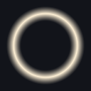

# Virtual Ring Light

A lightweight, high-performance browser extension that transforms your display into a soft fill-light / ring light frame for Google Meet, Microsoft Teams, Zoom, and video calls.

---

## Features

- **Click-Through Interaction (`pointer-events: none`)**: The overlay never blocks your mouse. Click mute, camera toggle, screen share, or chat controls seamlessly.
- **Shadow DOM Encapsulation**: 100% isolated layout guarantee. Host page styles (Meet/Teams) cannot affect or break the light overlay.
- **Color Temperature Controls**:
  - **Warm Tint** (~3000K soft golden glow)
  - **Daylight** (~4500K natural white fill)
  - **Cool Tint** (~6000K high clarity white)
  - **Custom Color Picker**: Choose any custom RGB color to match room lighting.
- **Overlay Shapes**:
  - **Frame**: Full perimeter border ring
  - **Top Bar**: Upper screen webcam fill strip
  - **Side Bars**: Dual side vertical fill panels
- **Brightness & Thickness Sliders**: Adjust light intensity (10% - 100%) and frame width (20px - 250px).
- **Keyboard Shortcut**: Press `<kbd>Alt + L</kbd>` (or `<kbd>Option + L</kbd>` on Mac) to toggle ON/OFF instantly.

---

## How to Adjust Settings & Colors

1. Click the **Extensions** menu icon in the top-right toolbar of Chrome / Brave / Edge.
2. Find **Virtual Ring Light** and click **Pin** so it stays visible in your toolbar.
3. Click the **Virtual Ring Light icon** anytime to open the control panel:
   - Toggle power ON/OFF
   - Select color temperature presets or custom colors
   - Change frame thickness and brightness sliders
   - Select overlay shapes

---

## Installation Guide

1. Clone or download this repository.
2. Open your Chromium browser and go to `chrome://extensions`.
3. Enable **Developer mode** in the top-right corner.
4. Click **Load unpacked**.
5. Select the project folder: `virtual-ringlight`.

---

## Pro-Tips for Dark Rooms

- **Increase Frame Thickness**: Move the thickness slider up to **120px - 180px** for broader fill coverage.
- **Set Brightness to 95%-100%**: Maximizes display luminance for maximum facial illumination.
- **Use Daylight Preset**: Pure white (`#ffffff`) delivers the highest lumen output from your monitor display.
